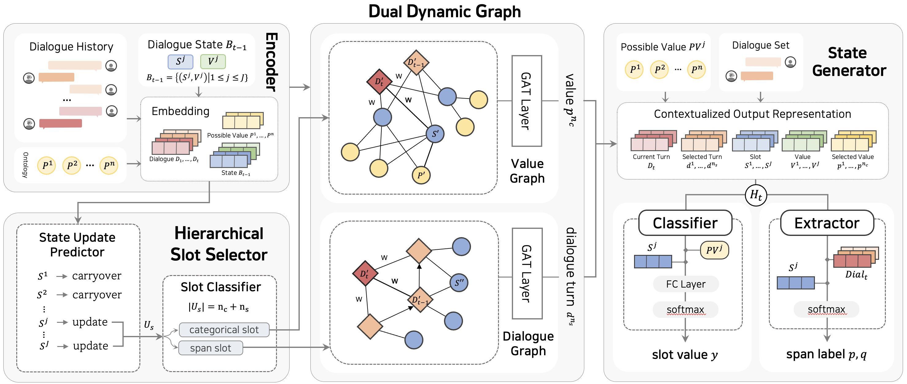

# HS2DG-DST
This paper/code introduces the **Multi-Domain Dialogue State Tracking
via Dual Dynamic Graph with Hierarchical Slot Selector(HS2DG-DST)**

The overview of HS2DG-DST:


## Setting
You can use `0ysDST.yaml` to import environment setting I used.
Or get setting with code below.
```shell
# conda activate 0ysDST # python=3.8

conda install pytorch==1.11.0 torchvision==0.12.0 torchaudio==0.11.0 cudatoolkit=11.3 -c pytorch
pip install transformers[sentencepiece]==4.24.0
pip install setproctitle
```
The pre-trained model we used is downloaded from [huggingface](https://huggingface.co/)

- Download the [albert-base-v2](https://huggingface.co/albert-base-v2/tree/main) pre-training model, included ```config.json``` ```pytorch_model.bin``` ```spiece.model``` 

- Put ```config.json``` ```pytorch_model.bin``` ```spiece.model``` into the ```pretrained_models/albert_large``` folder


## Dataset
The schema/ontology is already in `data` folder.
And you can download the dataset from [https://github.com/budzianowski/multiwoz](https://github.com/budzianowski/multiwoz)

#### preprocessed version
Thanks to [guo](https://github.com/guojinyu88/DiCoS-master), I used their preprocessed dataset.
- MultiWOZ 2.1: [Google Drive](https://drive.google.com/drive/folders/15Lsaevxbj9P84q8DAavEpHl42GOBTAV3?usp=sharing)
- MultiWOZ 2.2: [Google Drive](https://drive.google.com/drive/folders/1IsrlFRJOJMnJwMmGnCK8LIR8D98YzajG?usp=sharing)


## Train & Evaluation
Before training, make sure you have prepared all input files(```data/schema.json```, ```data/train_dials.json```, ```data/dev_dials.json```, ```data/dev_dials.json```) and pretrained models(```pretrained_models/```).

The train and evaluation code below.
```
$ conda activate 0ysDST

$ nohup ./train_model.sh > out/train_.out &
$ nohup ./eval_model.sh > out/eval_.out &

```
All model checkpoints will be saved to `./saved_models/`.